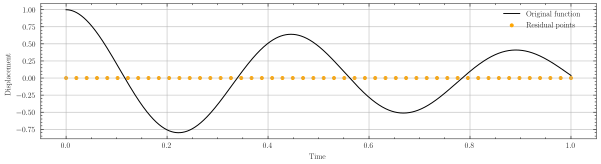
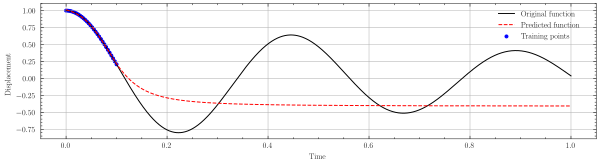
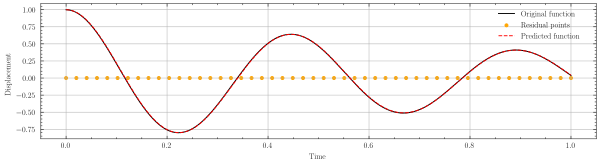

<h1 align="center"> A Comparative Study of Analytical, Neural Network, and Physics Informed Neural Network Approaches for Solving Partial Differential Equations</h1>

### About This Project
- This study aims to compare the effectiveness and performance of three different approaches: Analytical, Neural Networks, and Physics Informed Neural Networks, for solving PDEs across various scenarios.

- Neural Network result:

- Physics Informed Neural Networks result:

- See jupyter notebooks for more details

### Dependencies:
- Visual Studio Code. {recommended for easier setup}
- Dev Containers by Microsoft.
    [Dev Containers - Visual Studio Marketplace](https://marketplace.visualstudio.com/items?itemName=ms-vscode-remote.remote-containers)
- Docker.
    [Docker](https://www.docker.com/)
   
### Installation:
1. Clone the repository.
    ~~~
    git clone https://github.com/AZarbade/SHM-Experimental.git
    ~~~
2. Open it in Visual studio code.   
3. Open command pallet using "Ctrl + Shift + P".   
4. Search for "Dev Containers: Rebuild Container" and press "Enter".
5. This will build the entire project with all the required dependencies and at the prompts "Have fun!". This should indicate an errorless execution.
6. Project is now completely setup.   
